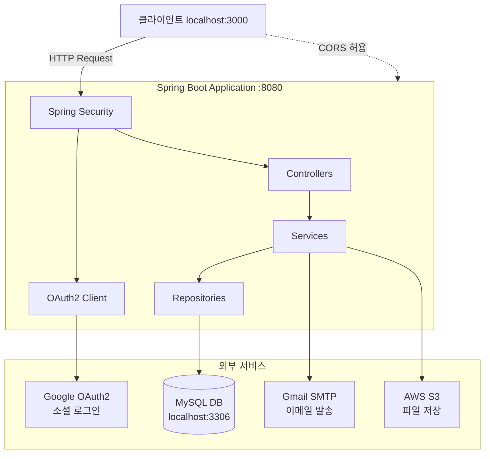

# Alpha-Note Backend 로컬 실행 가이드

## 1. 사전 준비 사항

### 1.1 개발 환경
- **Java 17** 이상 설치 필요
- **Gradle** (프로젝트에 Gradle Wrapper 포함되어 있음)
- **IDE**: IntelliJ IDEA 또는 Eclipse 권장

### 1.2 실행 프로파일 설정
로컬 환경 실행 시 `local` 프로파일을 활성화해야 합니다:
```
--spring.profiles.active=local
```

## 2. 데이터베이스 설정

### 2.1 MySQL 설치 및 데이터베이스 생성
```sql
-- MySQL 접속 후 실행
CREATE DATABASE alpha_note CHARACTER SET utf8mb4 COLLATE utf8mb4_unicode_ci;
```

### 2.2 데이터베이스 접속 정보
`application-local.yml` 설정 예시:
- **URL**: `jdbc:mysql://localhost:3306/alpha_note`
- **Username**: `root`
- **Password**: `your_db_password`

**참고**: JPA의 `ddl-auto: create` 설정으로 애플리케이션 시작 시 테이블이 자동 생성됩니다.

## 3. 외부 서비스 설정

### 3.1 Gmail SMTP 설정 (이메일 인증 기능)
`application-local.yml`에 다음 정보를 설정합니다:
- **Username**: `your_email@gmail.com`
- **Password**: `xxxx xxxx xxxx xxxx` (Gmail 앱 비밀번호)

**자체 Gmail 계정 사용 시**:
1. Gmail 계정에서 2단계 인증 활성화
2. 앱 비밀번호 생성 (Google 계정 > 보안 > 2단계 인증 > 앱 비밀번호)
3. `application-local.yml`의 `spring.mail.username`과 `password` 수정

### 3.2 Google OAuth2 설정 (소셜 로그인)
설정 예시:
- **Client ID**: `your_google_client_id.apps.googleusercontent.com`
- **Client Secret**: `your_google_client_secret`
- **Redirect URI**: `http://localhost:8080/login/oauth2/code/google`

**자체 OAuth2 앱 생성 시**:
1. [Google Cloud Console](https://console.cloud.google.com/)에서 프로젝트 생성
2. OAuth 2.0 클라이언트 ID 생성
3. 승인된 리디렉션 URI에 `http://localhost:8080/login/oauth2/code/google` 추가
4. `application-local.yml`의 `client-id`와 `client-secret` 수정

### 3.3 AWS S3 설정 (파일 업로드)
설정 예시:
- **Access Key**: `your_aws_access_key`
- **Secret Key**: `your_aws_secret_key`
- **Bucket**: `your_s3_bucket_name`
- **Region**: `ap-northeast-2` (서울)
- **CDN Base URL**: `https://your_cdn_domain.example.com`

**자체 S3 버킷 사용 시**:
1. AWS IAM에서 S3 접근 권한을 가진 사용자 생성
2. S3 버킷 생성 (서울 리전 권장)
3. `application-local.yml`의 AWS 설정 수정

### 3.4 JWT 시크릿 키
Base64 인코딩된 256비트 이상의 랜덤 시크릿 키를 설정합니다:
```
your_base64_encoded_jwt_secret_key_256bit_or_more
```

**자체 시크릿 생성 시**: 256비트 이상의 안전한 랜덤 문자열을 Base64로 인코딩하여 사용

## 4. 애플리케이션 실행

### 4.1 Gradle로 실행
```bash
# Windows
cd back
gradlew.bat bootRun --args='--spring.profiles.active=local'

# Linux/Mac
cd back
./gradlew bootRun --args='--spring.profiles.active=local'
```

### 4.2 IDE에서 실행
- Main Class: `com.alpha_note.core.CoreApplication`
- VM Options: `-Dspring.profiles.active=local`
- 또는 Environment Variables: `SPRING_PROFILES_ACTIVE=local`

### 4.3 빌드 후 JAR 실행
```bash
# 빌드
./gradlew build

# 실행
java -jar -Dspring.profiles.active=local build/libs/core-0.0.1-SNAPSHOT.jar
```

## 5. 확인 사항

### 5.1 애플리케이션 접속
- **서버 포트**: `8080`
- **Health Check**: `http://localhost:8080/actuator/health` (있는 경우)

### 5.2 CORS 설정
현재 `http://localhost:3000`만 허용되어 있습니다 (프론트엔드 개발 서버).
다른 포트를 사용하는 경우 `application-local.yml`의 `app.cors.allowed-origins` 수정 필요.

### 5.3 주요 의존성
- Spring Boot 3.4.8
- Java 17
- MySQL Connector
- Spring Security + OAuth2
- JWT (jjwt 0.12.3)
- AWS SDK S3
- Spring Mail
- Thymeleaf (이메일 템플릿)

## 6. 보안 권장사항

**주의**: 현재 `application-local.yml`에 민감한 정보(비밀번호, 시크릿 키 등)가 하드코딩되어 있습니다.

**프로덕션 또는 팀 공유 시**:
1. 민감한 정보를 환경변수로 변경
2. `.gitignore`에 `application-local.yml` 추가
3. `application-local.yml.example` 템플릿 파일 생성
4. `application-prod.yml`처럼 환경변수 방식 사용

## 7. 시스템 아키텍처



## 8. 트러블슈팅

### 8.1 데이터베이스 연결 실패
- MySQL 서버가 실행 중인지 확인
- 데이터베이스 이름, 사용자명, 비밀번호 확인
- 방화벽에서 3306 포트 허용 여부 확인

### 8.2 Gmail SMTP 오류
- Gmail 앱 비밀번호가 올바른지 확인
- 2단계 인증이 활성화되어 있는지 확인
- Gmail 계정에서 "보안 수준이 낮은 앱의 액세스" 비활성화 상태 확인

### 8.3 OAuth2 로그인 실패
- Google Cloud Console에서 리디렉션 URI 설정 확인
- Client ID/Secret이 올바른지 확인
- OAuth 동의 화면이 구성되어 있는지 확인

### 8.4 AWS S3 접근 오류
- IAM 사용자의 Access Key/Secret Key 확인
- S3 버킷 정책에서 해당 IAM 사용자의 권한 확인
- 버킷 이름과 리전이 올바른지 확인

---

## 빠른 시작 체크리스트

- [ ] Java 17 설치 확인
- [ ] MySQL 설치 및 `alpha_note` 데이터베이스 생성
- [ ] MySQL 사용자 계정 설정 (root/root123 또는 커스텀)
- [ ] `application-local.yml`에서 필요한 설정 확인/수정
- [ ] 터미널에서 `gradlew.bat bootRun --args='--spring.profiles.active=local'` 실행
- [ ] 브라우저에서 `http://localhost:8080` 접속 확인

