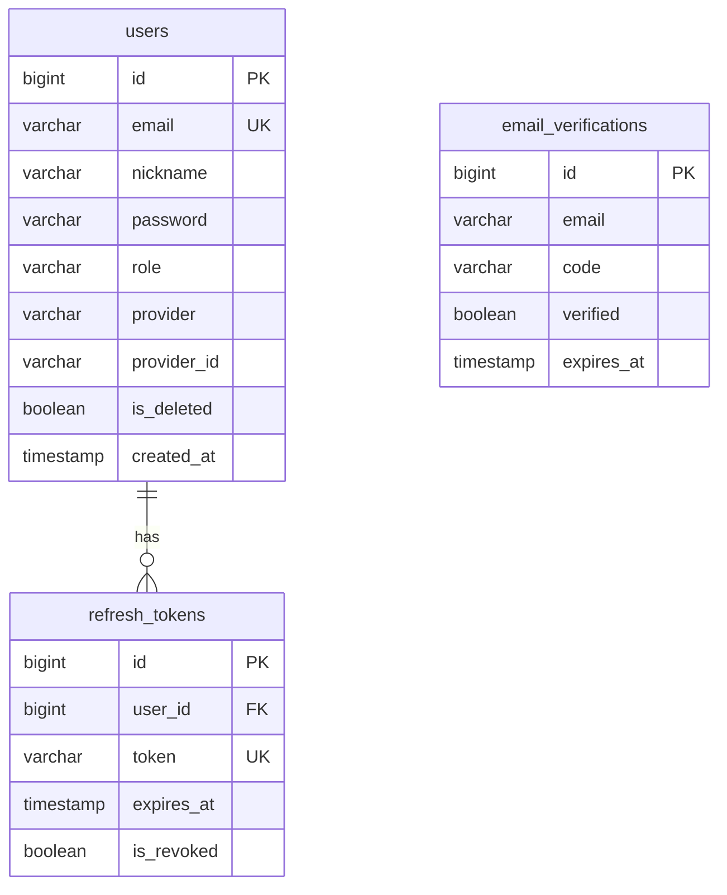
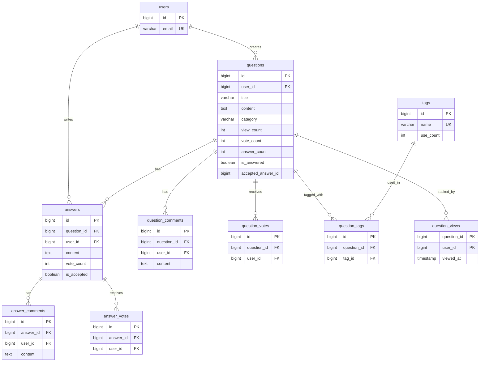
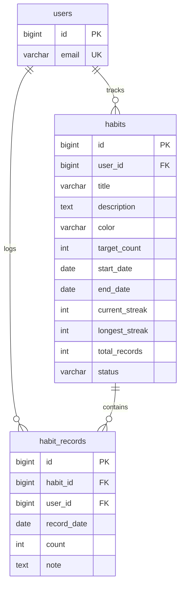
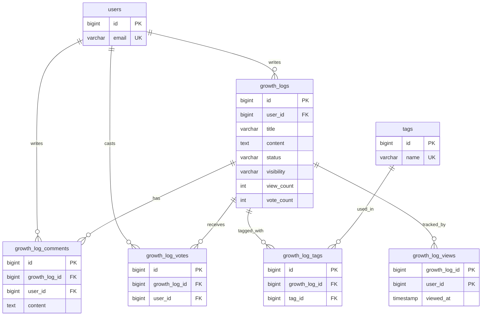
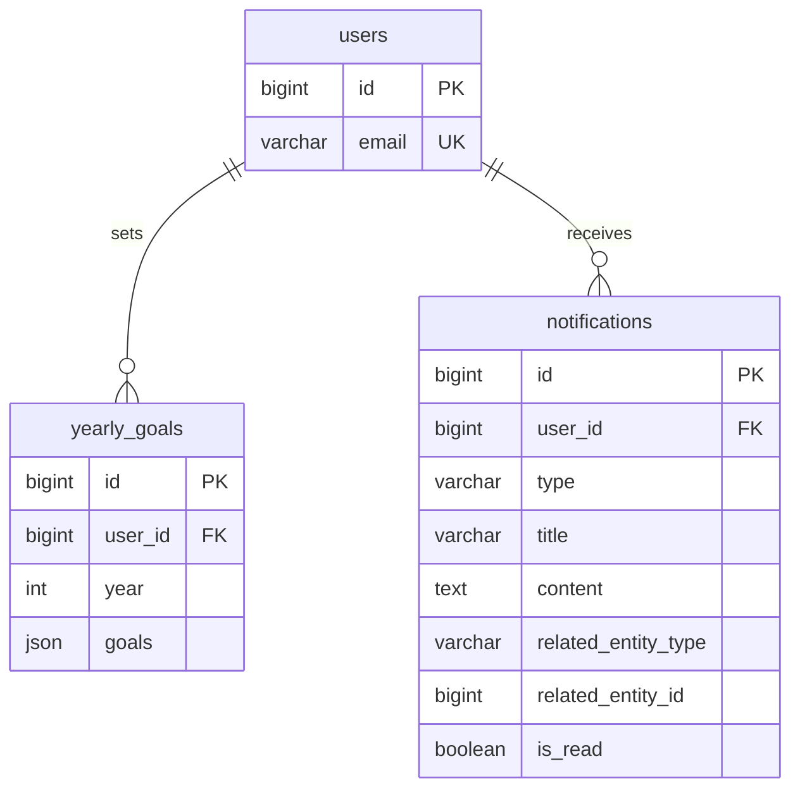

# Alpha-Note ERD (Entity Relationship Diagram)

> 최종 업데이트: 2026-02-02

---

## 전체 ERD

```mermaid
erDiagram
    %% ========== USER 도메인 ==========
    users {
        bigint id PK
        varchar nickname
        varchar email UK
        varchar password
        varchar role
        varchar provider
        varchar provider_id
        varchar profile_image_url
        boolean email_subscribed
        boolean account_locked
        timestamp password_expired_at
        timestamp last_password_reset_at
        boolean is_deleted
        timestamp deleted_at
        timestamp deletion_scheduled_at
        varchar deletion_reason
        timestamp created_at
        timestamp updated_at
    }

    %% ========== AUTH 도메인 ==========
    refresh_tokens {
        bigint id PK
        bigint user_id FK
        varchar token UK
        timestamp expires_at
        timestamp last_used_at
        boolean is_revoked
        timestamp created_at
    }

    email_verifications {
        bigint id PK
        varchar email
        varchar code
        boolean verified
        int attempt_count
        timestamp expires_at
        timestamp created_at
    }

    %% ========== QnA 도메인 ==========
    questions {
        bigint id PK
        bigint user_id FK
        varchar title
        text content
        varchar category
        int view_count
        int vote_count
        int answer_count
        boolean is_answered
        bigint accepted_answer_id
        timestamp last_activity_at
        boolean is_deleted
        timestamp deleted_at
        timestamp created_at
        timestamp updated_at
    }

    answers {
        bigint id PK
        bigint question_id FK
        bigint user_id FK
        text content
        int vote_count
        boolean is_accepted
        boolean is_deleted
        timestamp deleted_at
        timestamp created_at
        timestamp updated_at
    }

    question_comments {
        bigint id PK
        bigint question_id FK
        bigint user_id FK
        text content
        boolean is_deleted
        timestamp deleted_at
        timestamp created_at
        timestamp updated_at
    }

    answer_comments {
        bigint id PK
        bigint answer_id FK
        bigint user_id FK
        text content
        boolean is_deleted
        timestamp deleted_at
        timestamp created_at
        timestamp updated_at
    }

    question_votes {
        bigint id PK
        bigint question_id FK
        bigint user_id FK
        timestamp created_at
    }

    answer_votes {
        bigint id PK
        bigint answer_id FK
        bigint user_id FK
        timestamp created_at
    }

    question_tags {
        bigint id PK
        bigint question_id FK
        bigint tag_id FK
        timestamp created_at
    }

    question_views {
        bigint question_id PK,FK
        bigint user_id PK,FK
        timestamp viewed_at
    }

    %% ========== HABIT 도메인 ==========
    habits {
        bigint id PK
        bigint user_id FK
        varchar title
        text description
        varchar color
        int target_count
        date start_date
        date end_date
        int current_streak
        int longest_streak
        int total_records
        varchar status
        timestamp deleted_at
        timestamp created_at
        timestamp updated_at
    }

    habit_records {
        bigint id PK
        bigint habit_id FK
        bigint user_id FK
        date record_date
        timestamp logged_at
        int count
        text note
        boolean is_deleted
        timestamp created_at
        timestamp updated_at
    }

    %% ========== GROWTH_LOG 도메인 ==========
    growth_logs {
        bigint id PK
        bigint user_id FK
        varchar title
        text content
        varchar thumbnail_url
        varchar status
        varchar visibility
        int view_count
        int vote_count
        timestamp last_activity_at
        boolean is_deleted
        timestamp deleted_at
        timestamp created_at
        timestamp updated_at
    }

    growth_log_comments {
        bigint id PK
        bigint growth_log_id FK
        bigint user_id FK
        text content
        boolean is_deleted
        timestamp deleted_at
        timestamp created_at
        timestamp updated_at
    }

    growth_log_votes {
        bigint id PK
        bigint growth_log_id FK
        bigint user_id FK
        timestamp created_at
    }

    growth_log_tags {
        bigint id PK
        bigint growth_log_id FK
        bigint tag_id FK
        timestamp created_at
    }

    growth_log_views {
        bigint growth_log_id PK,FK
        bigint user_id PK,FK
        timestamp viewed_at
    }

    %% ========== GOAL 도메인 ==========
    yearly_goals {
        bigint id PK
        bigint user_id FK
        int year
        json goals
        timestamp created_at
        timestamp updated_at
    }

    %% ========== COMMON 도메인 ==========
    tags {
        bigint id PK
        varchar name UK
        text description
        int use_count
        boolean is_deleted
        timestamp deleted_at
        timestamp created_at
        timestamp updated_at
    }

    %% ========== NOTIFICATION 도메인 ==========
    notifications {
        bigint id PK
        bigint user_id FK
        varchar type
        varchar title
        text content
        varchar related_entity_type
        bigint related_entity_id
        boolean is_read
        timestamp created_at
    }

    %% ========== 관계 정의 ==========

    %% User 관계
    users ||--o{ refresh_tokens : "has"
    users ||--o{ questions : "creates"
    users ||--o{ answers : "writes"
    users ||--o{ question_comments : "writes"
    users ||--o{ answer_comments : "writes"
    users ||--o{ question_votes : "casts"
    users ||--o{ answer_votes : "casts"
    users ||--o{ question_views : "views"
    users ||--o{ habits : "tracks"
    users ||--o{ habit_records : "logs"
    users ||--o{ growth_logs : "writes"
    users ||--o{ growth_log_comments : "writes"
    users ||--o{ growth_log_votes : "casts"
    users ||--o{ growth_log_views : "views"
    users ||--o{ yearly_goals : "sets"
    users ||--o{ notifications : "receives"

    %% Question 관계
    questions ||--o{ answers : "has"
    questions ||--o{ question_comments : "has"
    questions ||--o{ question_votes : "receives"
    questions ||--o{ question_tags : "tagged_with"
    questions ||--o{ question_views : "tracked_by"

    %% Answer 관계
    answers ||--o{ answer_comments : "has"
    answers ||--o{ answer_votes : "receives"

    %% GrowthLog 관계
    growth_logs ||--o{ growth_log_comments : "has"
    growth_logs ||--o{ growth_log_votes : "receives"
    growth_logs ||--o{ growth_log_tags : "tagged_with"
    growth_logs ||--o{ growth_log_views : "tracked_by"

    %% Habit 관계
    habits ||--o{ habit_records : "contains"

    %% Tag 관계
    tags ||--o{ question_tags : "used_in"
    tags ||--o{ growth_log_tags : "used_in"
```

---

## 도메인별 ERD

### 1. USER & AUTH 도메인

---

### 2. QnA 도메인

---

### 3. HABIT 도메인

---

### 4. GROWTH_LOG 도메인

---

### 5. GOAL & NOTIFICATION 도메인

---

## 관계 요약표

| 부모 테이블 | 자식 테이블 | 관계 | 설명 |
|------------|------------|------|------|
| users | refresh_tokens | 1:N | 사용자별 리프레시 토큰 |
| users | questions | 1:N | 사용자가 작성한 질문 |
| users | answers | 1:N | 사용자가 작성한 답변 |
| users | habits | 1:N | 사용자의 습관 |
| users | growth_logs | 1:N | 사용자의 성장기록 |
| users | yearly_goals | 1:N | 사용자의 연도별 목표 |
| users | notifications | 1:N | 사용자에게 전송된 알림 |
| questions | answers | 1:N | 질문에 달린 답변 |
| questions | question_comments | 1:N | 질문에 달린 댓글 |
| questions | question_votes | 1:N | 질문에 대한 투표 |
| questions | question_tags | 1:N | 질문에 연결된 태그 |
| questions | question_views | 1:N | 질문 조회 기록 |
| answers | answer_comments | 1:N | 답변에 달린 댓글 |
| answers | answer_votes | 1:N | 답변에 대한 투표 |
| habits | habit_records | 1:N | 습관 실천 기록 |
| growth_logs | growth_log_comments | 1:N | 성장기록 댓글 |
| growth_logs | growth_log_votes | 1:N | 성장기록 투표 |
| growth_logs | growth_log_tags | 1:N | 성장기록에 연결된 태그 |
| growth_logs | growth_log_views | 1:N | 성장기록 조회 기록 |
| tags | question_tags | 1:N | 태그가 사용된 질문 |
| tags | growth_log_tags | 1:N | 태그가 사용된 성장기록 |

---

## 관련 문서

- [데이터베이스 스키마 상세](./DATABASE_SCHEMA.md)
- [MySQL DDL 스크립트](./ddl/schema.sql)
